# Pokémon Card Guessing Game

## Description

This is a Python application that challenges users to guess the Pokémon featured on a randomly selected Pokémon card with the aid of a brief description and various card data. The cards presently featured are from the Pokémon Trading Card Game's early releases including the Base, Jungle, Fossil and Team Rocket expansions as well as the Base Set 2, Legendary Collection and Wizards Black Star Promos special releases and reprints. Set information and card databases utilised are available from the ["pokemon-tcg-data" Github repository](https://github.com/PokemonTCG/pokemon-tcg-data) (Cealgair, 2017).

## Link to Pokémon Card Guessing Game remote repository

[Pokémon Card Guessing Game Github Repository.](https://github.com/htthecoder15/TT-t1a3-terminal_application)

## Help

### Software requirements

Python version 3.0 or greater.

### Application dependencies

* exceptiongroup==1.2.1
* iniconfig==2.0.0
* numpy==1.26.4
* packaging==24.0
* pluggy==1.5.0
* pytest==8.2.0
* tomli==2.0.1

### Hardware requirements

There are no hardware requirements to run this application.

### Installation

To install this application please download the project as a zip file and extract the files. Then, using a CLI that can run bash scripts, navigate to the folder and execute:

```bash
pokemon_guess.sh
```

This script will check if an appropriate version of Python is installed on your system and link installation instructions if it is not from <https://realpython.com/installing-python/> (Real Python, n.d.). Once an appropriate version of Python is installed, execute the program again and the script will create a virtual environment, launch the virtual environment, install the neccessary packages to run the application in this environment. The script will then launch the application.

### Additional help

When using the application, be sure to enter appropriate responses to the terminal prompts. You will be prompted with acceptable responses, please copy them accurately.

## Code Conventions

This application follows [Pep8 styling conventions](https://peps.python.org/pep-0008/) (Coghlan, van Rossum, Warsaw, 2001).

## Features

### Standard mode

#### Description

The typical game mode. Users are prompted to choose from one of the available Pokémon card expansions from which a random Pokémon card is selected (more on this process later). The card's flavour text (a narrative-styled description of the Pokémon depicted on the card) is shown to the user and they are prompted to either guess the Pokémon on the card or receive another hint. If the user selects hint, they are offered other data from the card: either the Pokémon's "retreat cost" as featured on the card or the name of a randomly selected attack featured on the card. Again, the user is offered another hint or the chance to guess. The user may choose from the Pokémon's evolutionary stage or card type for this third hint. Finally, the user is prompted to guess which Pokémon is featured on the card and their guess is assessed as either correct or incorrect. In both instances, the user is offered to play again or quit.

#### Logic

There are a variety of functions that implement gameplay functionality. Prominently, the game is built around ```while true:``` loops which repeatedly execute until the user inputs a valid response. These loops are preceeded by a terminal-printed message, accessed from a module containing dictionaries of all neccessary gameplay dialogue, that describes what inputs the user can make to advance the game. If the user does not input a valid response, the loop prints a reminder message describing the appropriate responses.

The code within the application is segregated into various modules for clarity. Also, to make changes easier and to follow DRY conventions, the app features various reusable functions. When standard gameplay is selected from the main menu, the an instance of the ```HintsAndScore``` class is initialised. This class features methods to store the hints that are delivered to the user so that they can be printed to the terminal and used for calculating scores. This instance, as well as a ```Scoreboard``` instance are passed to the ```standard_game()``` function which then executes a function to generate the round's random card. Once the card is generated, the flavour text is saved to the session's ```HintsAndScore``` instance as a string concatenated with a description of the hint's quality. This hint is then printed to the terminal.

The ```hint_guess_loop``` function prompts the user to either guess the Pokémon or trigger another loop that asks the user to choose between two hints. Again, the selected hint is added to the ```HintsAndScore``` instance, printed and the user is offered to guess or a third and final hint. After a third hint the user enters the ```guess_loop``` which triggers the ```guess``` function. Inside the guess function, the user is shown all hints they have received and asked to guess the card. The user's input is compared to the random cards "name" value and either a ```CorrectGuess``` or ```IncorrectGuess``` exception is raised to break the guess input loop.

Returned to the ```guess_loop()``` function, the user is prompted to play again via the ```play_again_loop()``` function which raises either a ```PlayAgain``` exception or a ```Menu``` depending on the input. The ```PlayAgain``` exception returns the user to the ```while True``` loop in the menu that immediately initiates the standard game play whilst the ```Menu``` exception returns the user to the original loop that offers the user to either play, view the scoreboard or terminate the application.

### Hard mode

#### Description

An alternative to the standard gameplay mode, hard mode randomly selects the mystery card from any of the available sets and only offers the user one hint: either a random attack or the Pokémon's stage. In addition, hard mode has a separate scoreboard from standard mode.

#### Logic

Hard mode uses many of the same processes as standard mode including being passed a ```HintsAndScore``` instance to store and print the given hints. Unlike standard mode, hard mode only triggers ```hint_guess_loop``` once and the user may only select between 'stage' and 'attack'.

The ```choose_hint_loop()``` prompts the user to input their selection which, when an appropriate input is received, triggers the ```hint_check()``` function twice. The ```hint_check()``` receives the mystery card's dictionary, the ```HintsAndScore``` instance, the hint choices and the user's response. It first compares the user's response to the available responses and, if they are matched, it checks whether the hint selected is "attack" or "type". If it is either of these hint types, unique logic is applied to access this data on the mystery card's dict as they sometimes nested inside an extra layer to the other card attributes. For the attack hint specifically, a random attack is selected using the ```random.randint()``` to target a random attack's index. If the user selects the "stage" hint, the terminal prints an additional reminder to user's explaining the "stage" attribute. Once the hint is added to the ```HintsAndScore``` instance, a ```HintAdded``` exception returns the user to the ```hard_mode()``` function, prints the flavour test and new hint and proceeds to the ```guess()``` function.

### Scoring and Scoreboard

#### Description

Each game mode also calculates a score for the user based on how many hints they have received. When the ```guess_function``` evaluates the user's guess, the user's score is calculated, a scoreboard file, unique to the type of game mode, is loaded and, if the user has recorded a new record, they are asked to input a name for their score which is then saved.

#### Logic

Because hints and scoring are linked in the application, they are both recorded and updated in a ```HintsAndScore``` instance. This class preserves all hints the user has received to for printing and to be used when calculating score. Concurrently, a ```Scoreboard``` instance keeps track of the user's session ID as well as the selected game mode's scoreboard. When the user initialises a ```Scoreboard``` instance and executes the ```.set_current_game_mode()``` method, the selected game mode's scoreboard file is loaded from a JSON file and a session ID is generated. Random session ID numbers are generated using ```random.randint``` and compared to all scores saved in the scoreboard until the number is not a duplicate. This session ID is then preserved as long as the user keeps electing to play again.

When the user's guess is deemed correct or incorrect, their score is compared to each entry on the scoreboard. If the session ID is the same as another entry on the scoreboard, such as if the user has continued their streak, the score is updated and the user is prompted to play again or quit. If the session ID does not match any entries, the score is compared to each entry on the scoreboard until the session score is calculated to be higher than any entry. The user is then prompted to enter a name for their score that is less than five characters. Similarly, even if the user's score is not higher than any score on the scoreboard, if there are less than five entries on the scoreboard, the user is prompted to input a name.

Once the user has input their name, the score is added to the list of dictionaries at the appropriate index. This updated scoreboard, tracked by the ```Scoreboard``` instance, is used to overwrite the appropriate scoreboard JSON file. Notably, the user will not be prompted to input their name again if they improve their score after electing to "play again" yet their score will again be compared to all entries and inserted at the appropriate spot.

The two scoreboards can be accessed from the the app's main menu by entering a scoreboard sub-menu. In this sub-menu, the user can choose between 'standard' and 'hard' to view either leaderboard's entries.

### Random Card Select

#### Description

In both game play modes, the ```gen_rand_card()``` function is used to generate the mystery card and return a dictionary with the appropriate attributes for gameplay. In standard mode, the user is prompted to choose from an available expansion for the card to be chosen from whilst, in hard mode, the card is randomly selected from any of the available expansions.

#### Logic

When imported, the ```random_card_gen()``` module uses ```os.listdir()``` to create a list from the collection of JSON files of card data held within the application. Manipulating these file names, the expansions' data including their name, id, directory and release date are grouped in a dictionary for later reference.

In standard mode, a list of all available set names are presented to the user and the user is prompted to choose the set from which their random card will be selected. In hard mode, ```random.randint()``` and ```len()``` are used to randomly select an expansion from this list.

In both modes, this selection prompts the loading of the appropriate card data JSON. Once this JSON is loaded, another random index is calculated and used to pick a random card within that expansion. The card is evaluated as to whether it is both a Pokémon (as opposed to a trainer or item) card and whether it has flavor text (certain expansions feature Pokémon without descriptions). If these conditions are true, the card's 'convertedRetreatCost" attribute is assessed and, for cards with no retreat cost, a "0" retreat cost is assigned. Similarly, if the card has no attacks, the card is assigned an attack attribute of "This Pokémon has no attacks". Once these checks are complete, the function returns the neccessary data as a dictionary and gameplay commences.

### Spell check

The guess function utilises a ```typo_eval()``` function that tests whether the user's guess was off by a small error. This allows for users to incorrectly spell the correct Pokémon's name without being penalised.

#### Description

When the user inputs their guess, their response and the mystery card are passed to the ```typo_evaluation()``` function. The typo function iterates through the correct answer and compares the letters to the user's response. For every same letter, a local ```same_letters_score``` tracks how many letters the user's guess has right. If the ```same_letters_score``` divided by the length of the correct answer is 50%, the user is prompted to try again, after being notified that their spelling was close and they may have had a typo.

Because user's responses may be dramatically different in length than the correct answer, attempting to target particular indexes in the response or answer can cause index errors. These errors are caught and cause the typo check to cease and the user's answer to be deemed incorrect.

## Implementation plan and project management

### Implementation Plan

To write my implementation plan, I broke down the neccessary steps to create my application in a simple excel table.

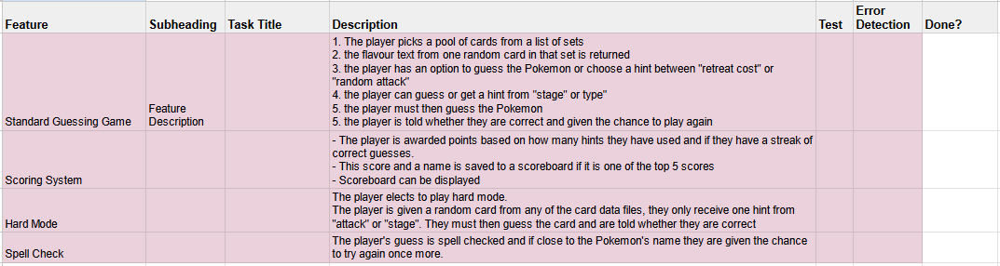
A wholistic list of the features I planned to implement in my application.

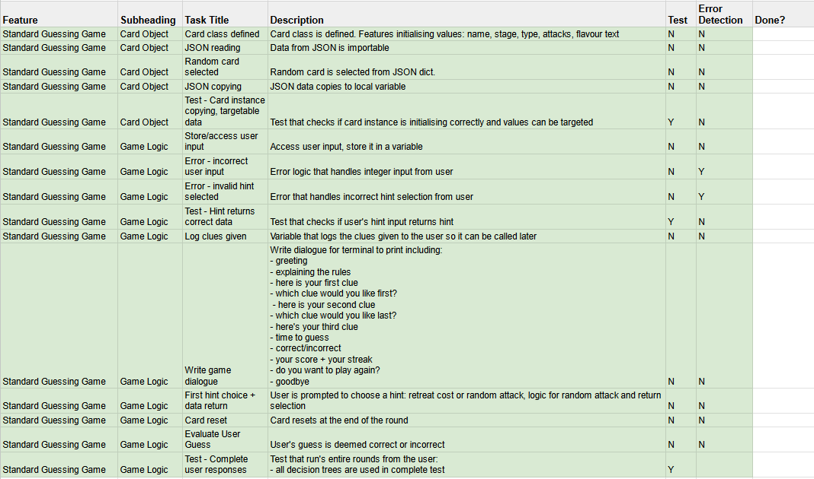
A list of steps neccessary to implement standard mode gameplay. Notably, I initially intended (and designed) the mystery card to be generated and stored in a class but I changed this during development.

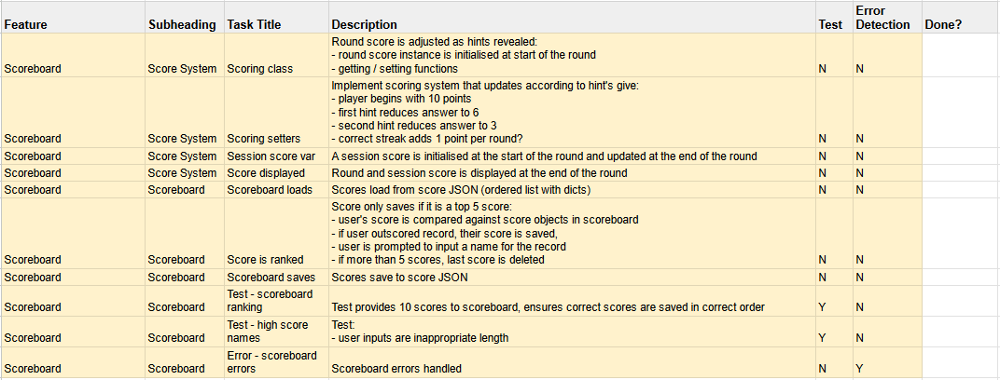
A list of steps neccessary to implement scoring and the scoreboard functionality. Again, I initially intended the score to be saved as properties in a class but changed this to attributes stored in a class.

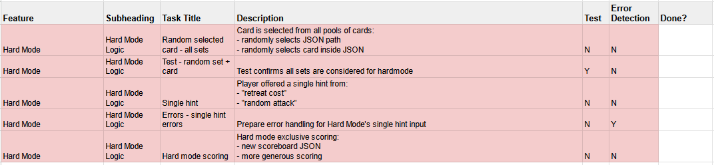
A list of steps planned to implement the hard game mode.

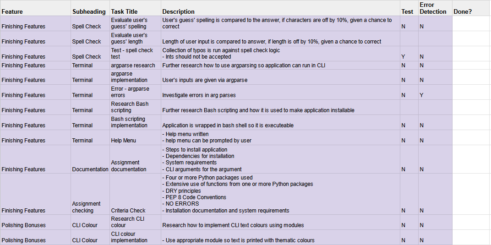
A list of steps required to finalise the apps functionality and features. I initially intended to pass variables to the application using argparse but soon realised this was not neccessary. Similarly, I initially intended to utilise the CLI color package in the app but did not have time to implement it.

### Timeline of project management

To view the Trello board I used to track progress [click here.](https://trello.com/b/7519EyS8/t1a3-terminal-application)

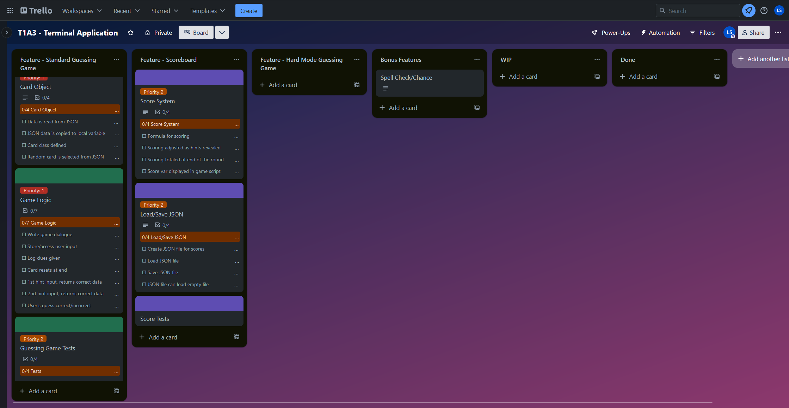
Day one.

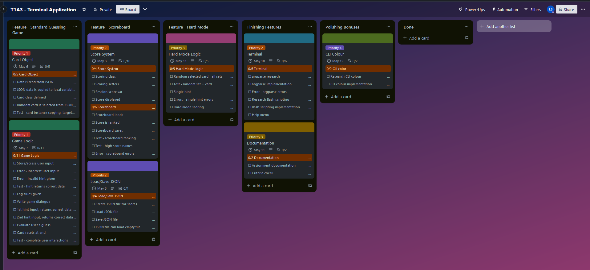
Day two.

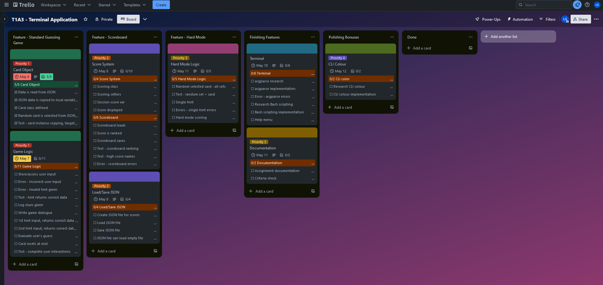
Day three.

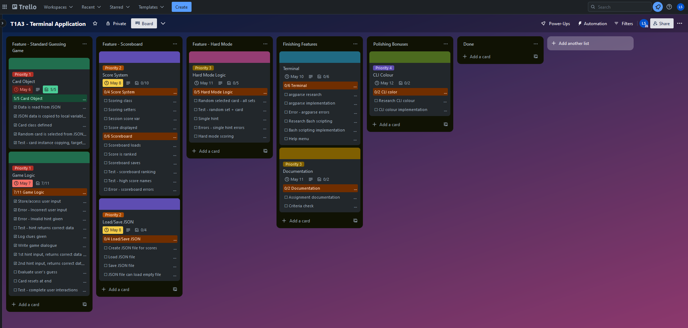
Day four.

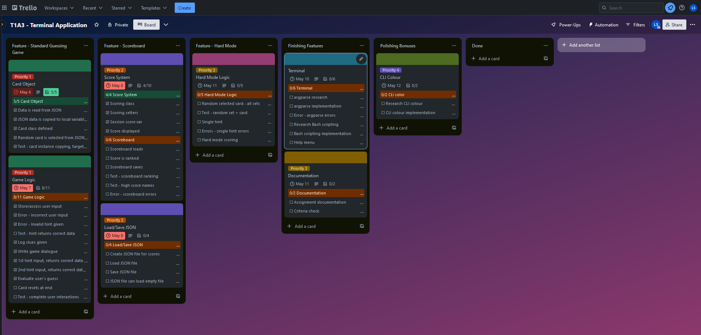
Day five.

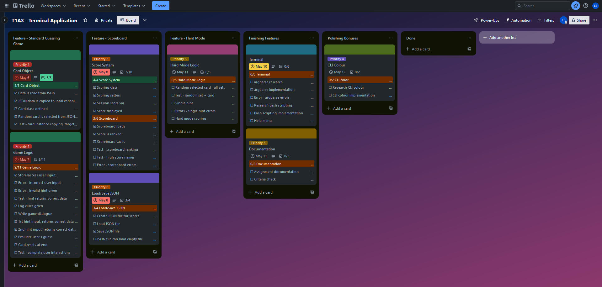
Day six.

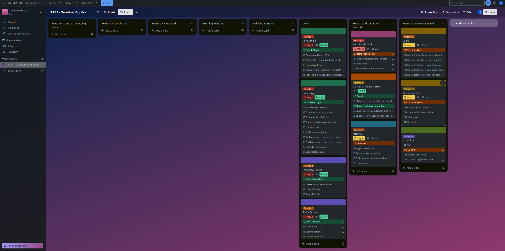
Day seven part one. Notably, on this day, I reassessed where I was at in the project's implementation and readjusted my priorities to finish the application on time. I removed argparse from my to-dos after realising I did not need to implement it.


Day seven part two.

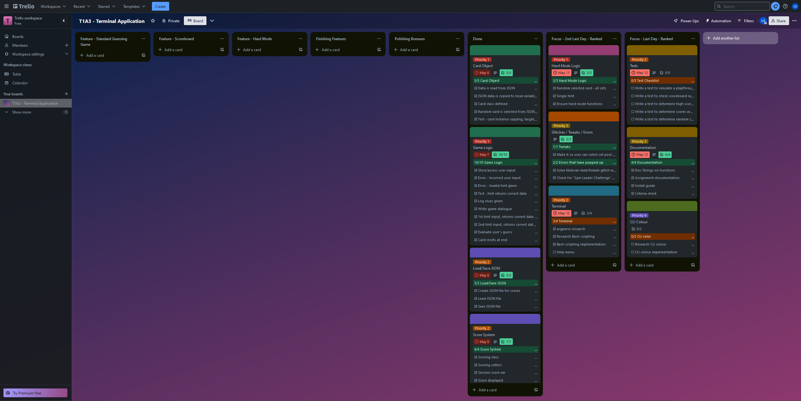
Day eight. Submission.

## Imported packages and modules

To create the application I used various modules and packages:

* various function and module imports between application source code
* os
* numpy
* JSON
* pytest

## References

Cealgair (2017) _pokemon_-_tcg_-_data_
, URL <https://github.com/PokemonTCG/pokemon-tcg-data>, accessed 4 May 2024.

Coghlan, A., van Rossum, G., Warsaw, B. (2001) _Pep 8 - Style Guide for Python Code_, URL <https://peps.python.org/pep-0008/>, accessed 4 May 2024.

Real Python (n.d.) _Python 3 Installation & Setup Guide_, URL <https://realpython.com/installing-python/>, accessed 4 May 2024.
